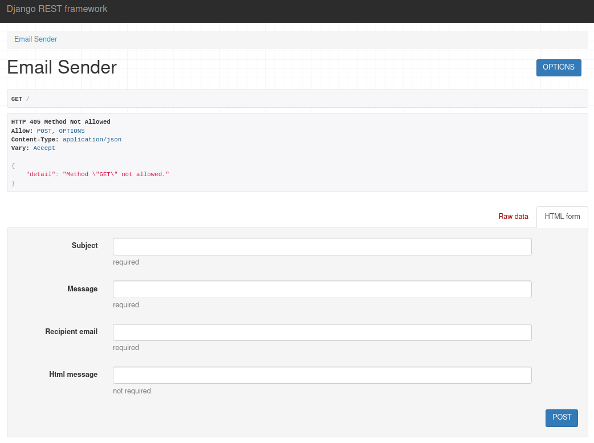

# emailsender

**emailsender** is a Restful API service for sending emails.
It provides an interface for sending emails:

## Usage

```sh
$ curl -X POST -d "subject=hello&message=text&recipient_email=xyb@mydomain.com&html_message=" \
    localhost:8000/
"xyb@mydomain.com"
```

The `html_message` field is not required.

It uses [Django REST framework](https://www.django-rest-framework.org/), so you can also access this interface through your browser.



## Configuration

You should customize your configuration to suit your requirements.
All configurations can be set via environment variables.
The following are the configured default values:

```python
# 0: production, 1: devlopment
DJANGO_DEBUG = 1

# specify hosts seperated by commas
DJANGO_ALLOWED_HOSTS = '*'

# 1: print email to screen, not sending
EMAIL_BACKEND_TEST = 0

# idle seconds
MAILER_EMPTY_QUEUE_SLEEP = 5

# 1: ssl smtp
EMAIL_USE_SSL = 0

# 1: tls smtp
EMAIL_USE_TLS = 0

EMAIL_HOST = smtp.mydomain.com

EMAIL_HOST_USER = 'xyb@mydomain.com'

EMAIL_HOST_PASSWORD = 'password'

EMAIL_PORT = 465

EMAIL_FROM = 'xyb@mydomain.com'

# fail if smtp server response too slow
EMAIL_TIMEOUT = 3

# regex, for example: '.*@mail1.com$|.*@mail2.com'
EMAIL_WHITE_LIST = r'.*'

# message on rejection
EMAIL_WHITE_LIST_MESSAGE = 'unacceptable email address'

# specify hosts separeated by commas
CORS_ALLOWED_ORIGINS = ''

# 1: accept any remote host
CORS_ALLOW_ALL_ORIGINS = 0

DB_ENGINE = 'django.db.backends.sqlite3'

DB_NAME = BASE_DIR / 'db.sqlite3'

DB_USER = 'postgres'

DB_PASSWORD = ''

DB_HOST = ''

DB_PORT = ''
```

## Docker

There are pre-built [docker images](https://hub.docker.com/r/xieyanbo/emailsender).
You can use docker-compose for deployment.
This is a template of `docker-compose.yml`:

```yaml
version: "3"

services:
  emailsender:
    image: xieyanbo/emailsender:latest
    container_name: emailsender
    environment:
      - TZ=Asia/Hong_Kong
      - DJANGO_SECRET_KEY=some-secret-string
      - DJANGO_DEBUG=0
      - EMAIL_BACKEND_TEST=0
      - EMAIL_USE_SSL=1
      - EMAIL_USE_TLS=0
      - EMAIL_HOST=smtp.mydomain.com
      - EMAIL_PORT=465
      - EMAIL_HOST_USER=xyb@mydomain.com
      - EMAIL_HOST_PASSWORD=password
      - EMAIL_FROM=xyb@mydomain
      - EMAIL_WHITE_LIST=.*@mydomain.com$$|.*@mydomain2.com$$
      - EMAIL_WHITE_LIST_MESSAGE=for mydomain.com and mydomain2.com only
    ports:
      - 8000:8000
    restart: always
```
